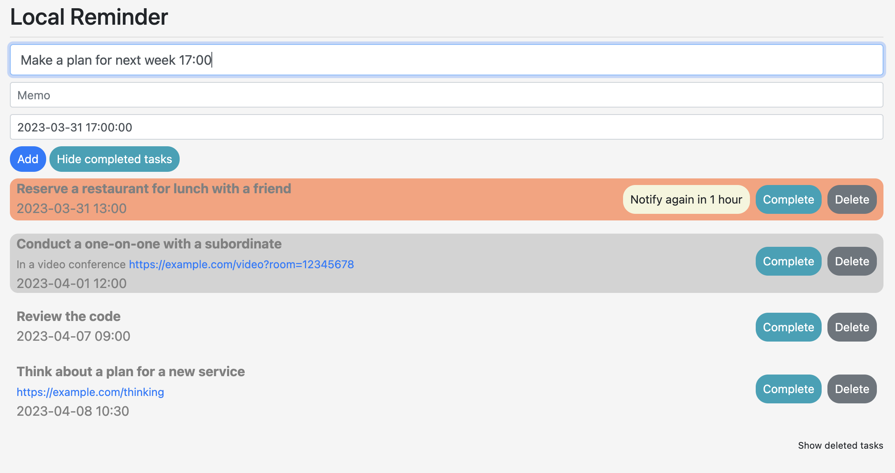

# Local Reminder

Local Reminder is an Electron-based reminder app.

It stores reminder data in the local machine's Local Storage.

## Features
It's a simple reminder.

You can register a reminder by entering the task content in the task registration field and pressing Enter.

At that time, it automatically reads and sets the date and time from the text.

For example, if the current time is 2023/03/20 10:00, entering "Tasks Title 0401" will automatically set the date and time field to "2023/04/01 00:00".

Entering "Task Title 10:30" will set it to "2023/03/20 10:30".

I wanted to bring back the behavior of Apple's past reminders.

## Screen Image

<div align="center">
  
</div>

## Install

```bash
Copy code
npm install electron @electron-forge/cli
npm run make
cp -r out/LocalReminder-darwin-arm64/LocalReminder.app /path/to/Applications
```

